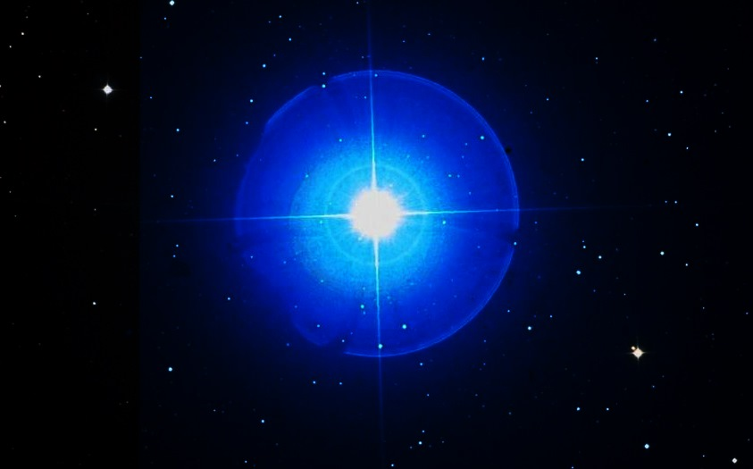

# Seginus
Spotify's integration WebApp made With React

## ¿Why Seginus?
Seginus is a *binary* star system in the northern consttellation of Boötes the herdsman, forming the left shoulder of this asterism. [Wikipedia](https://en.wikipedia.org/wiki/Gamma_Bo%C3%B6tis).

